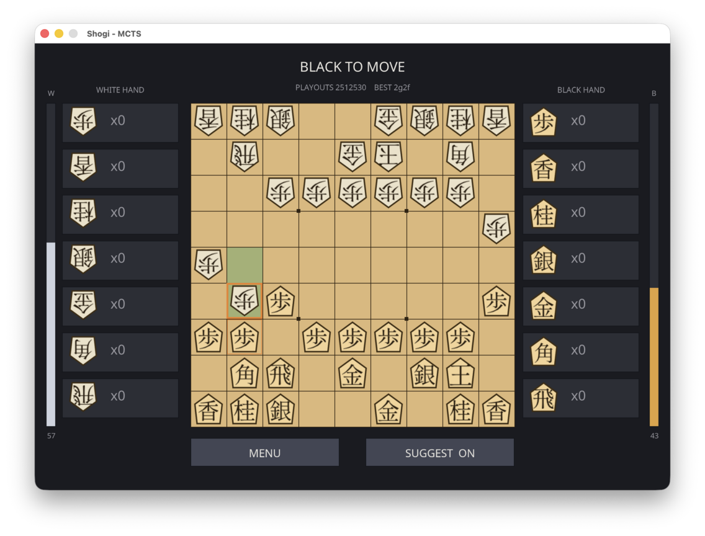

# Shogi

A standalone Shogi (Japanese chess) game in C++ with an SDL3 interface and a
multi-threaded, incremental Monte-Carlo Tree Search (MCTS) AI.

[**Play online multi-threaded Wasm build**](https://nullprogram.com/shogi/)



## Features

- **Three play modes** — human vs human (hotseat), human vs computer (either
  side), and computer vs computer.
- **Multi-threaded MCTS** — one shared search tree grown by a pool of worker
  threads, using virtual loss to keep concurrent threads on distinct paths and
  a UCT rule that balances exploitation against exploration.
- **Incremental search** — the engine searches *continuously*, including while
  a human is thinking ("pondering"). That same ongoing search powers:
  - **Move suggestions** — the engine's current best move is outlined on the
    board (toggle with the `SUGGEST` button or the `S` key).
  - **Position-strength bars** — vertical bars on each side of the board fill
    in proportion to that side's estimated winning chances, updating live as
    the search deepens.
- **Compact state representation** — a `Position` is a small, trivially
  copyable POD (an 81-byte board, hand counts, side to move, Zobrist hash) so
  MCTS can clone nodes with a single cheap copy.
- **Full Shogi rules** — drops, promotion (optional and forced), two-pawn
  (*nifu*) and drop-mate (*uchifuzume*) restrictions, checkmate detection, and
  fourfold-repetition (*sennichite*) draws.
- **Traditional kanji pieces** — pieces show their Japanese kanji (歩 香 桂 銀
  金 角 飛 王/玉, and と 杏 圭 全 馬 龍 promoted), rotated for the facing side.
  The kanji and a Mincho UI font are an embedded anti-aliased glyph atlas, so
  no asset files are needed at runtime.
- **Multi-platform** — SDL3 for window, rendering and input.

## Building

Requires CMake (>= 3.16) and a C++17 compiler. SDL3 is used if installed;
otherwise it is fetched and built automatically (needs network access on the
first configure).

```sh
cmake -S . -B build -DCMAKE_BUILD_TYPE=Release
cmake --build build -j
./build/shogi
```

### Web (WebAssembly)

With the [Emscripten SDK](https://emscripten.org) on `PATH`:

```sh
web/build.sh                            # -> build-web/
python3 -m http.server -d build-web     # then open index.html
```

`web/build.sh` builds two variants — multi-threaded (`-pthread`) and
single-threaded — and assembles `build-web/` with a loader. `index.html` tries
to cross-origin-isolate the page with a service worker (`enable-threads.js`);
if that succeeds the browser provides `SharedArrayBuffer` and the
**multi-threaded** build is used, otherwise it falls back to the
**single-threaded** build (one core, correspondingly slower AI). The result is
fully static and needs no special server headers, so it deploys to any host,
GitHub Pages included — just publish the contents of `build-web/`.

## Playing

- Pick a mode on the start screen.
- **Move a piece:** click it, then click a destination. Legal destinations are
  shown as dots. If a move may optionally promote, a dialog asks; forced
  promotions happen automatically.
- **Drop a piece:** click one of your captured pieces in the side panel, then
  click an empty square.
- `MENU` returns to mode selection; `Esc` does the same (or quits from the
  menu).

## Layout of the code

| File | Responsibility |
|------|----------------|
| `board.{hpp,cpp}` | State representation, move generation, rules, evaluation |
| `mcts.{hpp,cpp}`  | Thread-safe incremental MCTS over a shared tree |
| `engine.{hpp,cpp}`| Worker-thread pool driving the search |
| `ui.{hpp,cpp}`    | SDL3 rendering, input and game flow |
| `glyphs.hpp`      | Embedded glyph atlas — ASCII + kanji (generated) |
| `main.cpp`        | Entry point |

## Notes / limitations

- The AI uses MCTS with capped, capture-biased random rollouts finished by a
  material evaluation. It plays a reasonable amateur game; it is not a strong
  engine. Search strength scales with core count and the per-move time budget
  (`THINK_MS` in `ui.cpp`).
- Repetition is scored as a simple fourfold draw; the perpetual-check
  exception (where the checking side loses) is not implemented.
