# A beginner's guide to shogi

Shogi (将棋) is the Japanese cousin of chess: two players, alternating turns,
checkmate to win. It has been played in roughly its modern form since the
sixteenth century, and is still the most popular abstract strategy game in
Japan.

This guide assumes no prior chess knowledge. It walks through the board, all
nine piece types, every rule you need to play a complete game, and a couple
of well-known opening ideas.

All diagrams use the same artwork as the program itself. The English piece
names appear alongside their kanji and romanized Japanese throughout.

---

## 1. What makes shogi different from chess

Three rules give shogi its character:

1. **Drops.** When you capture an enemy piece it joins your "hand" instead of
   leaving the game. On a later turn, instead of moving a piece on the board,
   you can drop one of those captured pieces onto any empty square as your
   own. No piece ever truly leaves the game.
2. **Promotion.** When a piece enters, leaves, or moves within the last three
   ranks of the board (your opponent's side), you may flip it to a more
   powerful form for the rest of the game.
3. **No colour.** Both players use the same pieces - they're all the same
   colour, identified only by which direction their pointed top faces. Pieces
   you capture become yours.

These three rules together mean shogi games rarely run out of material; the
endgame is usually a sharp tactical race instead of a slow grind.

---

## 2. The board and the starting position

The board is 9 columns by 9 rows. Each player begins with 20 pieces:
one king, one rook, one bishop, two gold generals, two silver generals,
two knights, two lances, and nine pawns.

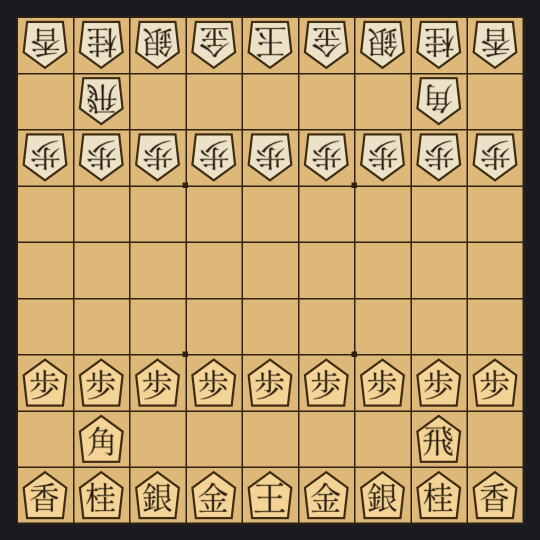

The player at the bottom of the diagram moves first. In Japanese they're
called _sente_ ("the one who goes first", often translated "Black"); the
other side is _gote_ ("the one who follows", "White"). Pieces have no actual
colour: you can tell which is which by which way the pointed top of the
piece faces. Yours point away from you; your opponent's point toward you.

---

## 3. The pieces

Each piece type has its own movement pattern. The dots in each diagram below
mark every square the piece could move to from the center on an empty board.

### King · 王 / 玉 (ōshō / gyokushō)

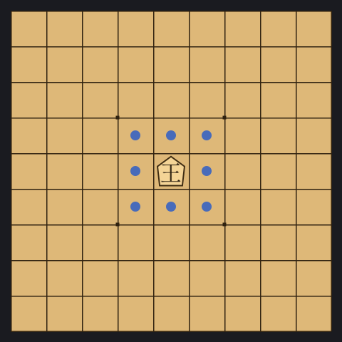

The king moves one square in any direction. The game ends when one king is
checkmated. Tradition reserves the slightly fancier glyph 王 for the
higher-ranked player; the program follows the usual convention of giving 王
to Black and 玉 to White.

### Rook · 飛車 (hisha)

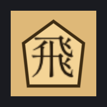
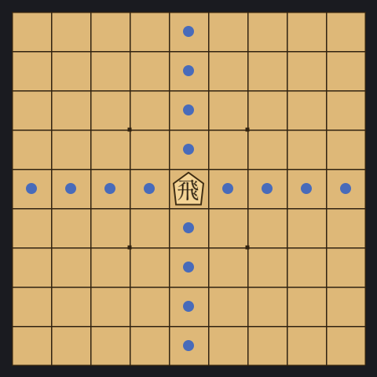

The rook slides any number of empty squares horizontally or vertically -
exactly like a chess rook.

### Bishop · 角行 (kakugyō)

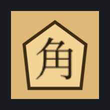
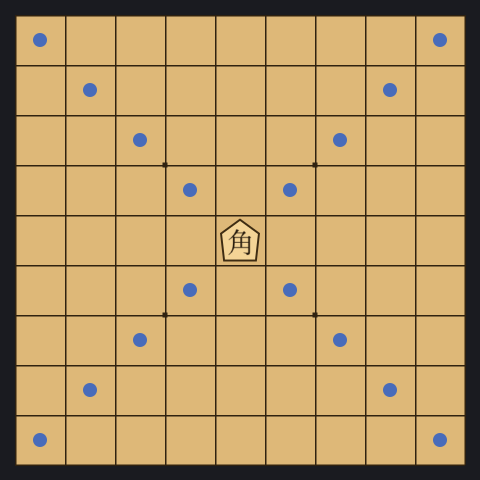

The bishop slides any number of empty squares along a diagonal - exactly
like a chess bishop. Note that each side has only one bishop, and they
start on opposite-coloured squares: a bishop can never attack the enemy
bishop directly.

### Gold general · 金将 (kinshō)

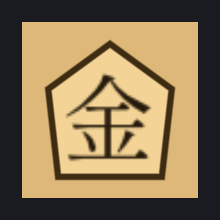
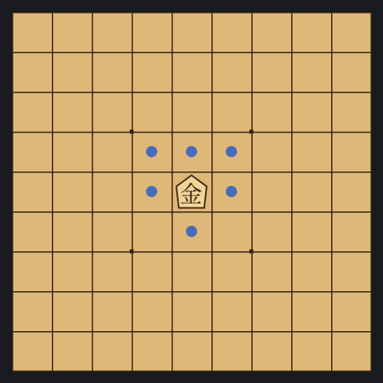

The gold general steps one square in any direction except diagonally
backward. It is the workhorse defender of the king. The gold cannot promote.

### Silver general · 銀将 (ginshō)

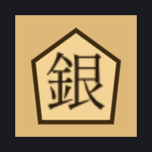
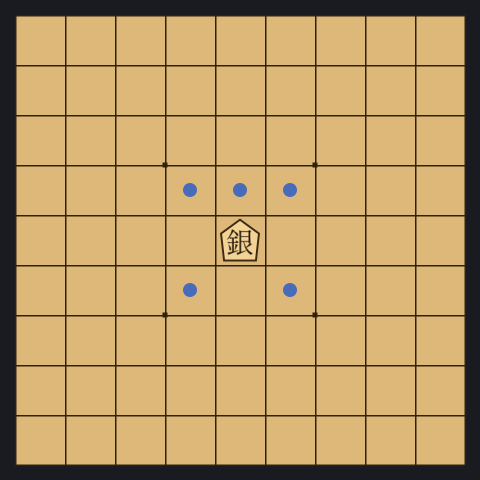

The silver steps one square in any of the five "forward" directions: the
three squares ahead, and the two diagonals behind. Silvers are quick to
deploy in attack; they're also the gold's most common partner in a castle.

### Knight · 桂馬 (keima)

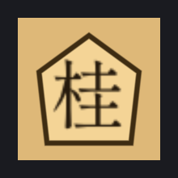
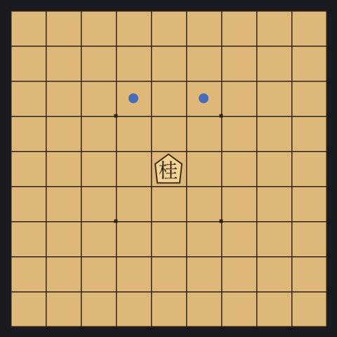

The knight is the only piece that jumps. It moves two squares forward and
one to the side - a smaller pattern than the chess knight, and it can never
move backward or sideways. A shogi knight only has two destination squares;
once you let it past the centre, it cannot retreat.

### Lance · 香車 (kyōsha)

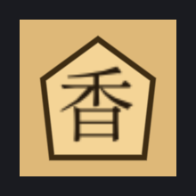
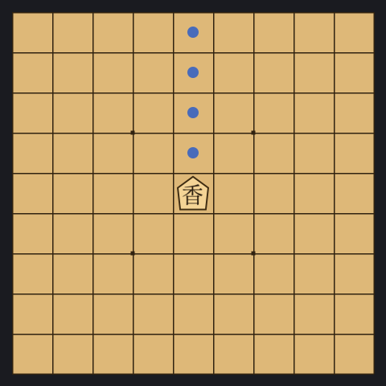

The lance slides any number of empty squares straight forward, like a
forward-only rook. It cannot move backward or sideways.

### Pawn · 歩兵 (fuhyō)

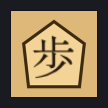
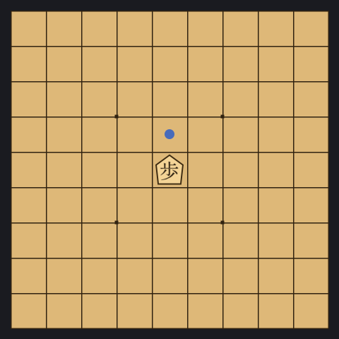

The pawn steps one square straight forward. It captures the same way it
moves - straight ahead, not diagonally as in chess. There are no
two-square first moves and no _en passant_. With nine pawns per side
forming a continuous wall, pawn structure dominates shogi strategy.

### Promotion: the back six pieces

Pawn, lance, knight, silver, bishop, and rook can all be **promoted** when
they move through the promotion zone (see §6). A promoted piece is shown
with a red glyph and behaves differently:

| Original | Promoted | Reads | New movement |
|---|---|---|---|
| Pawn | 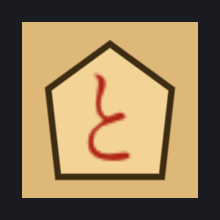 | tokin (と) | like a gold |
| Lance | 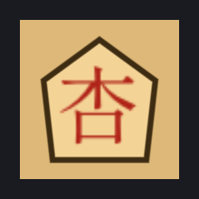 | narikyō (杏) | like a gold |
| Knight | 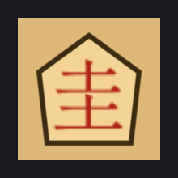 | narikei (圭) | like a gold |
| Silver | 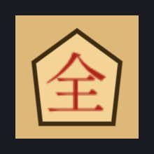 | narigin (全) | like a gold |
| Bishop | 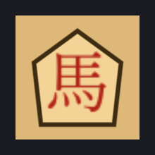 | uma / horse (馬) | bishop + one-square king moves |
| Rook | 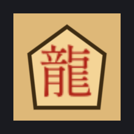 | ryū / dragon (龍) | rook + one-square diagonal moves |

Pawn/lance/knight/silver all promote to _something like a gold_ - the small
pieces get a useful upgrade, but stay equally valuable as defenders. The
bishop and rook keep their existing power and gain extra short-range moves
on top, becoming the most dangerous attackers on the board:

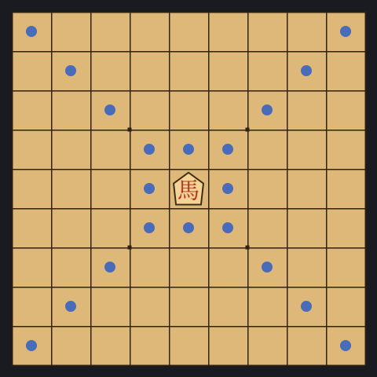
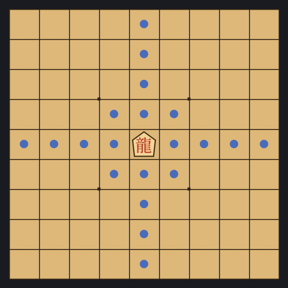

The gold and the king do not promote.

---

## 4. Captures, check, and checkmate

On your turn you can either move one of your pieces, or drop a captured
piece (see §5). When one of your pieces moves onto a square holding an
enemy piece, you **capture** it: it comes off the board and joins your
hand, ready to drop later. You cannot capture your own pieces.

If any of your moves would attack the enemy king, the enemy is in
**check**. The opponent must respond by either moving the king to safety,
blocking the attack, or capturing the attacker. If they cannot, the
position is **checkmate** and you win.

You may not leave your own king in check - any move that does is illegal.

---

## 5. Drops

When it's your turn, instead of moving a piece, you may take any piece from
your hand and **drop** it onto any empty square. The dropped piece becomes
yours and is unpromoted - even if it was promoted when you captured it.

Two restrictions matter:

### Nifu (二歩) - "two pawns"

You may not drop a pawn onto a file that already contains one of your own
unpromoted pawns. (Promoted pawns don't count - they're tokin, not pawns
any more.)

### Uchifuzume (打ち歩詰め) - "checkmate by dropped pawn"

You may not drop a pawn to deliver checkmate. (You _can_ drop a pawn to
deliver check; the rule only forbids the drop when the position would be
mate.) Any other piece is allowed to mate via drop - only the pawn drop is
restricted.

A couple of other restrictions are automatic rather than ones you have to
remember: pawns and lances can't be dropped on the last rank (they'd have
no legal move), and knights can't be dropped on the last two ranks for the
same reason.

---

## 6. Promotion

The shaded bands in the diagram below are each side's **promotion zone**:
the last three ranks from that side's view. Black promotes in the top
three ranks; White promotes in the bottom three.

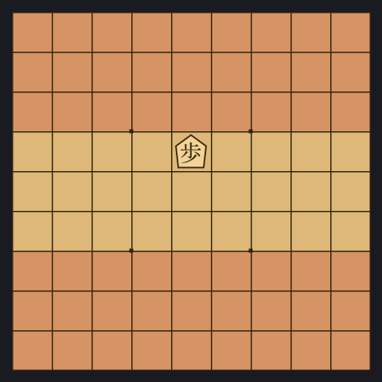

When a promotable piece (pawn, lance, knight, silver, bishop, rook) moves
_into_, _within_, or _out of_ its promotion zone, you may choose to
promote it as part of that move. The decision is one-time and permanent
for that piece; once promoted it stays promoted until it is captured (at
which point it reverts to its unpromoted form in the captor's hand).

Promotion is mandatory whenever the piece would otherwise have no legal
move. A pawn or lance reaching the last rank, or a knight reaching one of
the last two, must promote.

Promotion is almost always good for the small pieces (they trade their
restricted moves for a gold's flexibility) and a clear gain for the rook
and bishop (they keep what they had and add more). The two cases where you
might decline are: keeping a silver unpromoted to use its diagonal-back
moves later, or keeping a rook unpromoted briefly to threaten a deeper
attack before committing.

---

## 7. Ending the game

**Checkmate.** As in chess, the player whose king cannot escape check
loses. Most games end this way or by resignation just before.

**Resignation.** Strong shogi players resign well before they run out of
moves; resigning a clearly lost position is considered good etiquette.

**Stalemate.** Almost never happens in shogi because the loser can always
drop a piece to make a legal move. By rule, a player with no legal move
loses.

**Sennichite (千日手) - "thousand-day repetition".** If the same position
(same pieces, same side to move, same hands) is reached four times, the
game is a draw - _unless_ the repetition was forced by perpetual check, in
which case the perpetually-checking side loses. The intuition is "if the
attacker can force the position to repeat by checking, the attack failed".

![Perpetual check: black's horse (the promoted bishop, 馬) on 3c gives
check to the cornered white king. The own pawn on 1b blocks the
southward escape, so the king's only legal move is K-2a. On the next
move black plays Horse-3b — the horse steps one square forward,
again giving check, this time supported by the lance on 3f so the king
cannot capture it. The king's only escape from 2a is back to 1a, and
black plays Horse-3c to renew the original check. This four-half-move
cycle repeats indefinitely; because black is the one forcing the
checks, after four repetitions black loses by the perpetual-check
rule.](img/sennichite.png)

---

## 8. A sample opening: bishop exchange

Let's play through the most direct opening in shogi - the **Bishop
Exchange** (角換わり _kakugawari_). Each diagram shows the position after
the move named above it; the green highlight marks the square the moving
piece arrived on.

### 1. ☗P-7f - black opens the bishop diagonal

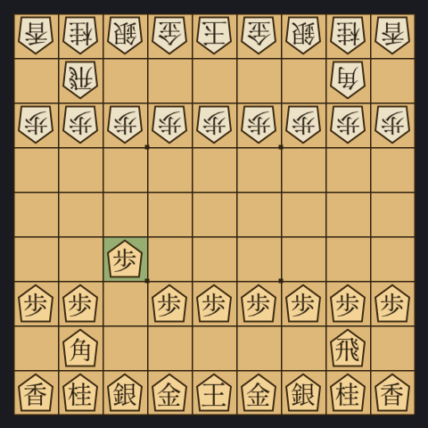

Black pushes the pawn on file 7 one square forward. This isn't a direct
threat; it lets the bishop see along the long diagonal toward white's
half of the board.

### 1... ☖P-3d - white mirrors

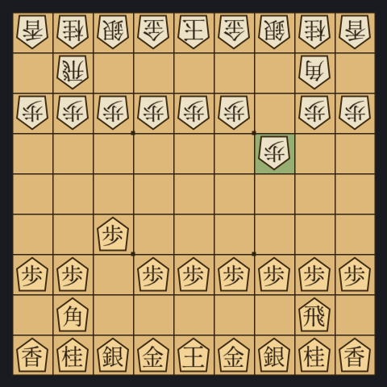

White makes the symmetric move, opening their own bishop diagonal.
Both bishops now have a clear path all the way to the opposite corner -
each one is staring directly at the other.

### 2. ☗Bx2b+ - the bishops trade

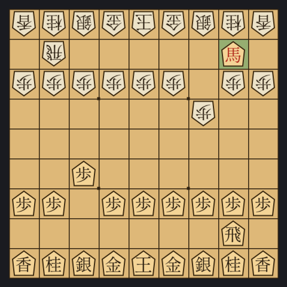

Black's bishop slides up the diagonal and captures white's bishop on 2b.
Because 2b is inside black's promotion zone (the last three ranks from
black's view), black can - and does - promote the bishop on the same
move, turning it into a **horse** (馬, the red glyph). The captured white
bishop comes off the board and joins black's hand as a regular,
unpromoted bishop, ready to be dropped later. The "+" at the end of the
move means "promote".

### 2... ☖Sx2b - white recaptures

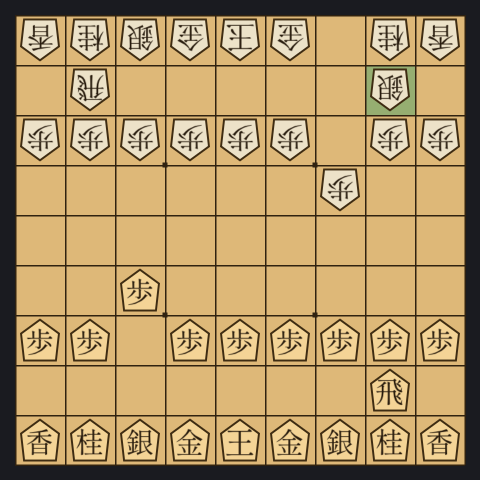

White's silver from 3a moves diagonally and captures the horse on 2b.
The horse comes off the board and joins white's hand. Promoted pieces
**always revert to their unpromoted form when captured**, so white gains
an ordinary bishop in hand, not a horse.

After only two exchanges, both players have a bishop in hand. **Pieces
in hand are enormously powerful** - you can drop them as a fresh
attacking piece anywhere there's an empty square, with no need to walk
them across the board. The next several moves of a game like this one
are about deciding _where_ and _when_ each side will eventually deploy
its bishop - the bishop in hand often shapes the rest of the opening
more than the pieces still on the board.

After the bishops are exchanged the game settles down, and both players
turn to building **castles** around their kings.

---

## 9. Castles: the Mino

A castle is a defensive formation around the king, usually built before
attacking. The most popular castle for a player whose rook has _swung_ to
the centre or left (a Ranging Rook strategy) is the **Mino** (美濃囲い).

The diagrams below show only Black's pieces, since White is busy building
their own castle on the opposite side of the board and would just be
sitting still in these frames.

### Step 0: starting position

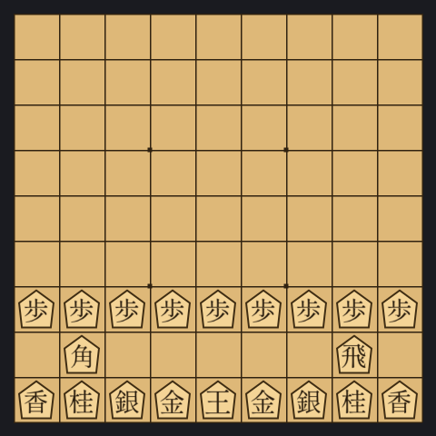

### Step 1: rook swings to file 6

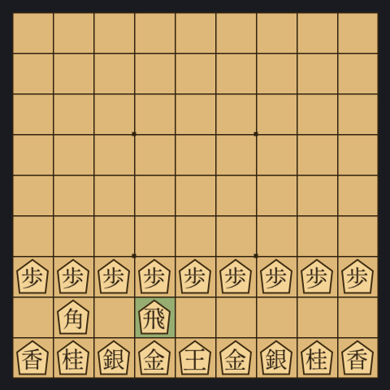

R-6h. The rook leaves its home at 2h and slides all the way over to 6h.
Two things matter here: the rook gets behind a wall of pawns where it's
hard to attack, and the right-hand side of the board (where the king is
about to live) is cleared out.

### Step 2: the king migrates to the corner

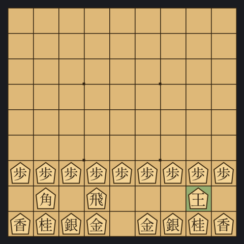

The king takes three single-square steps from 5i to 2h, slipping into the
corner the rook just vacated. (For clarity the diagram shows the final
square rather than each step in between.)

### Step 3: silver and gold form the shield

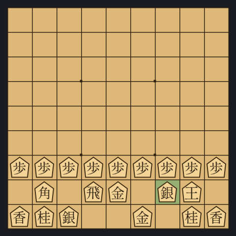

S-3h, then G-5h. The silver from 3i steps up to 3h, just left of the
king; one gold from 6i climbs to 5h. The other gold stays on its
starting square at 4i. The result - king, silver, gold, gold in a tight
diamond - is the **Mino castle**.

### Step 4: open an escape with the lance pawn

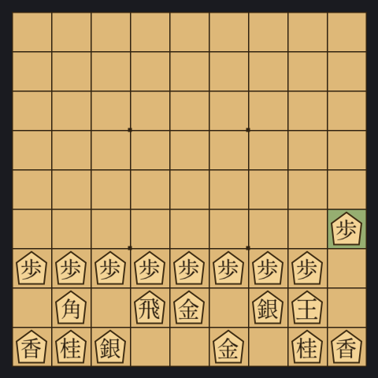

P-1f. Push the pawn in front of the king's lance forward one square.
This is small but important: it gives the king an escape square at 1g if
it ever gets attacked along its back rank. Most experienced players treat
this push as part of completing the castle.

The Mino is fast to build, gives the king shelter behind a wall of three
defenders, and leaves the rook free to attack. Its main weakness is the
file 1 corner; a more thorough variant called High Mino or Silver Mino
plugs it by adding more moves.

---

## 10. An attacking idea: Climbing Silver

Castles are defence. The other side of an opening plan is the attack -
where the silver, bishop, and rook combine to break through somewhere on
the enemy side of the board. **Climbing Silver** (棒銀 _bōgin_, literally
"stick silver") is the most famous attacking pattern: the silver from file
3 marches straight up the rook's file to crash through White's defences.

Again, only Black's pieces are shown - imagine White's army on the other
side of the board, defending their own king.

### Step 1: push the rook pawn

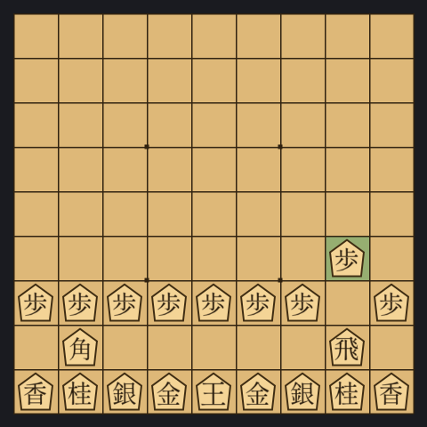

P-2f. The pawn in front of the rook advances, the standard opening for
any attack on file 2.

### Step 2: push it again

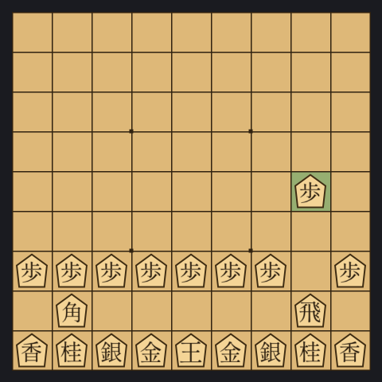

P-2e. The pawn pushes one more square, claiming the file. (Between these
two moves, White has made a couple of moves of their own - typically a
matching pawn push on the opposite side.)

### Step 3: the silver leaves the back rank

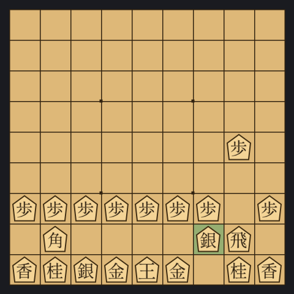

S-3h. The silver steps out of the back rank, eyeing the rook's file.

### Step 4: the silver climbs to file 2

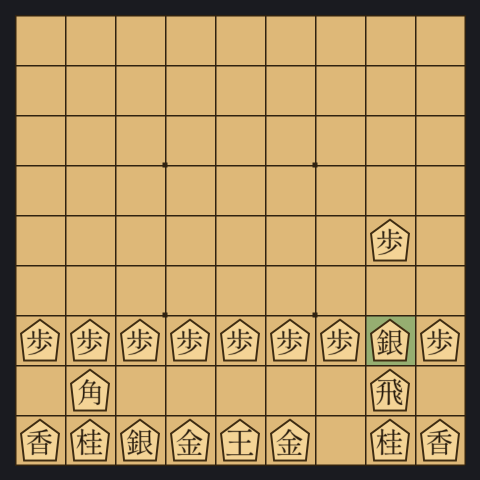

S-2g. The silver moves diagonally up to file 2, getting behind its
pushed-up pawn.

### Step 5: the silver supports the attack

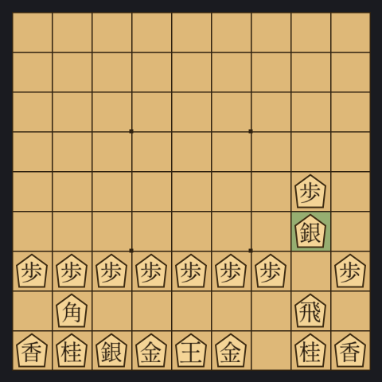

S-2f. The silver stands shoulder to shoulder with its pawn at 2e. The
plan now is to push P-2d, sacrificing the pawn so the silver can break
through and threaten the enemy rook and any pieces behind it.

Climbing Silver is direct, hard to refute without preparation, and a great
first attacking plan for new players because the moves are short and the
target is obvious.

---

## 11. Where to go from here

You now know enough to play complete games. To get better:

- **Play.** The strongest learning tool is just playing. The built-in
  engine in this program will give you a steady opponent at any level you
  choose - drop the search budget to make it easier, raise it to be
  challenged.
- **Tsume (詰将棋) puzzles.** Forced-mate puzzles - usually mate in 1, 3,
  5, ... - are how every Japanese player sharpens their tactics. Plenty of
  free collections are online.
- **Watch professional games.** Modern professional games are streamed
  with English commentary on sites like YouTube; the patterns repeat
  often, and watching how strong players handle castle-vs-castle attacks
  is the fastest way to absorb practical knowledge.

Enjoy the game!
